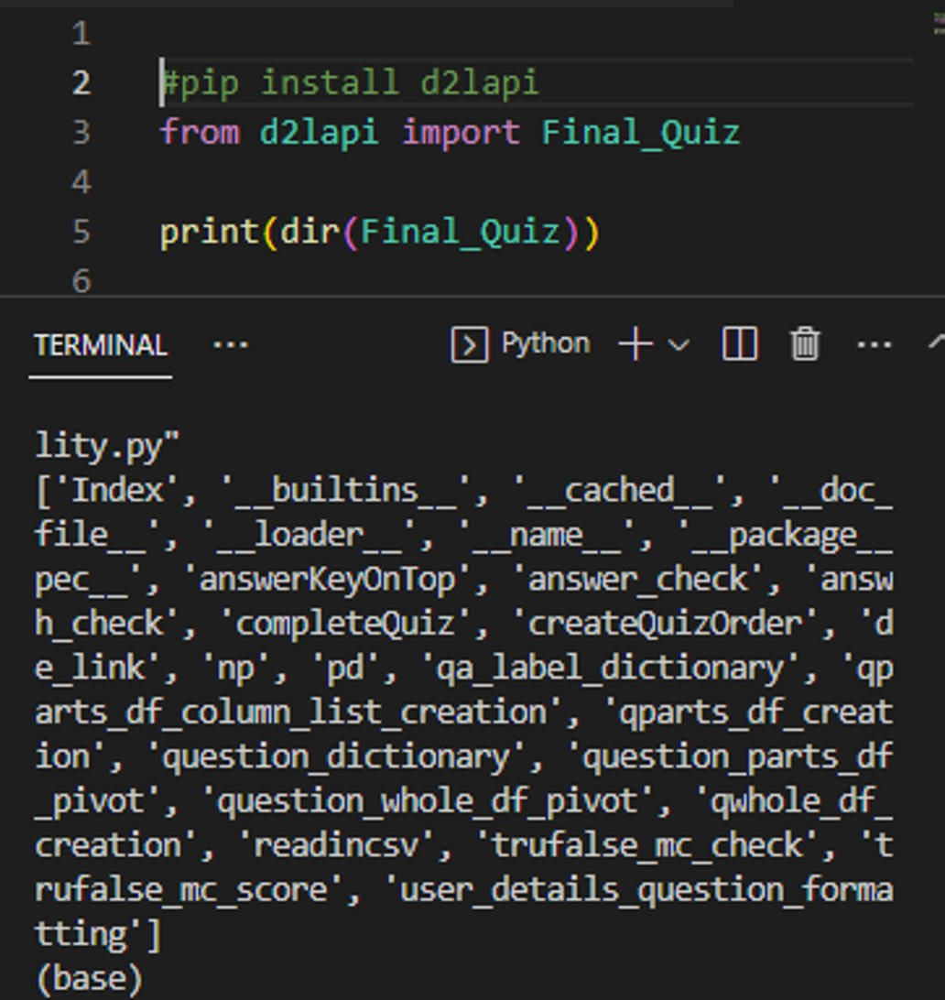
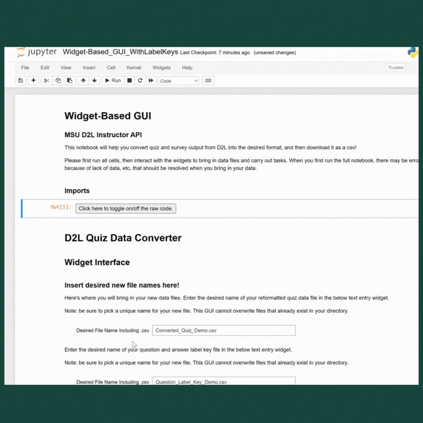
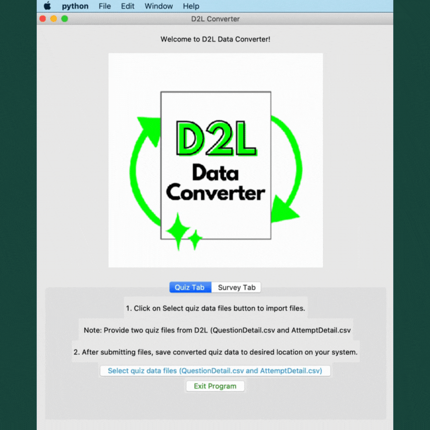
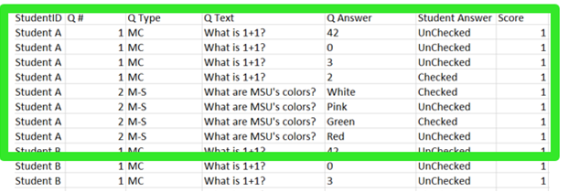
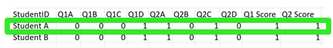
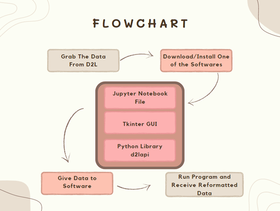

# MSU D2L Instructor API 
---
## Authors

| Name     | Email |
| ----------- | ----------- |
| Olivia Qiu  | [qiuolivi@msu.edu](mailto:qiuolivi@msu.edu)   |
|  Erin Sawyer  | [sawyerer@msu.edu](mailto:sawyerer@msu.edu)  |
|  Jonah Masaki Wehner | [wehnerjo@msu.edu](mailto:wehnerjo@msu.edu)|
|  Jiaye Xie   | [xiejiaye@msu.edu](mailto:xiejiaye@msu.edu) |
|  Pranay Pentaparthy  | [pentapar@msu.edu](mailto:pentapar@msu.edu)|

---

## Abstract

The MSU D2L Instructor API addresses issues with D2L’s quiz and survey data output to provide more useful student performance data to educational researchers and instructors at Michigan State University. Users can access the functionality in three ways: a Python library with functions that convert the data; a Widget-Based GUI, which is an interactive Jupyter Notebook; and the application-like Tkinter GUI that completes the process with just the click of a button. Because the data cleaning functionality was fairly intensive, based on direction from our sponsors, our team focused on creating an accessible program that achieved the desired output: clean data. However, we hope that future teams can build on our project, expanding functionality to include more visualizations and automated analysis.  
&nbsp;

---
## Background and Motivation

*Figure 1: Some questions instructors might pose in regards to D2L data*

This project is part of Michigan State University's (MSU) capstone course, CMSE495: Experiential Learning in Data Science, which provides data science majors the opportunity to apply their skills in real-world projects. As part of this course, we collaborated on a project sponsored by Michigan State University (MSU) to develop a data cleaning API for the Desire to Learn (D2L) learning management system. The initial goal of this project was to streamline the process of extracting, analyzing, and interpreting student performance data for instructors and researchers, originally through a planned data analysis API. However, in working with our sponsors, we narrowed our focus to the first step in this process: data cleaning.   

  
Instructors and educational researchers at MSU often work with D2L quiz and survey data to gain insights into student performance and the effectiveness of their teaching methods. However, the current data export process is cumbersome, and the data format is not user-friendly. This is a headache even for the most technically-experienced instructors, and can be very discouraging to instructors who do not have the technical knowledge to reformat the data themselves. It also limits the possibilities for using other software that aids or automates data analysis. 
Creating a reproducible, consistent, and automated process for handling this data would be highly beneficial to educational researchers and instructors, enabling them to provide more data-driven instruction. The motivation behind this project is to address these challenges faced by instructors and researchers in working with D2L data by creating a versatile Application Programming Interface (API) tool. We want instructors to be able to take full advantage of the wealth of data generated by D2L, and feel empowered in doing so, regardless of their level of technical knowledge. This tool will facilitate data cleaning, allowing users to more easily access and interpret student performance data. The project aims to enhance the quality of education by empowering instructors to make data-driven decisions in their teaching practices. 

A variety of considerations guided the direction of this project, primarily effectiveness and accessibility. By developing a user-friendly graphical user interface (GUI) for the API, this project will provide an accessible solution for instructors and researchers to work with the D2L data. The GUI will enable users to interact with the API effortlessly, making it an attractive solution that instructors will want to use. By providing clear instructions and examples, the project aims to deliver a working API that future instructors can easily use and adapt to their specific needs.

Overall, the D2L Instructor API project seeks to improve the educational experience at Michigan State University by providing instructors and researchers with an efficient, intuitive, and insightful tool for understanding student performance data. We hope this tool will help enable them to make informed decisions to enhance their teaching methods, adapt their curriculum, and provide individualized support to students, by improving the process for analyzing their data, starting with that first cleaning step.   
&nbsp;

---
## Methodology

While there are existing options for exporting quiz and survey data from D2L, they are extremely unintuitive and require extensive cleaning and reformatting to be useful for analyzing individual student and class performance. This is the core problem behind our project and informs our technical process. 

The standard output file contains a row for each student, for each question, for each answer choice. In other words, for each question, a student will have as many rows as there are answer options with a column for “checked” or “unchecked” indicating which choices they chose. For instance, for this example, for a quiz with two questions with four answer choices each, each student will have at least 8 rows of data. The output also contains information like the question number, question type, answer choices, and score. With this format, a simple 10 question quiz for 30 students could have nearly 1200 rows. This data format would be considered more of a 'long' data format, and is not compatible with data analysis programs, and thus, research applications

Our team was tasked with reformatting the D2L output from a long format to a wide format, and converting quiz/survey attempt data into a binary format where each column represented an answer choice for each question, and each row represented an attempt by a user. D2L also offers a variety of question types for instructors, including multiple choice, multiple select, matching, ordering, written, etc. Therefore, we faced an additional challenge where different question types needed to be handled differently. For example, written response questions posed a unique challenge, as fill in the blank-type answers cannot be logically binarized without losing meaning. 

To start, we set out to understand D2L from an instructor's perspective. With the help of our instructional team, we created a fake D2L course where we were the course administrators, and enrolled all of our CMSE495 classmates. We used MSU's resources to learn about creating quizzes and surveys, and practiced creating and administering sample questions. We then wrote a sample quiz and survey that aimed to take full advantage of the many customization options offered, ensuring that we would have testing data for all different types of questions. Our classmates took these sample assessments, generating our sample dataset. This dataset was crucial to building and testing our functionality. 

We researched various software packages and theories to help us develop a solution. One of the main tools we used was the Pandas library, which is a powerful Python library for data manipulation and analysis. We used Pandas to transform the original long-format dataset into a wide-format dataset by pivoting the data on specific columns. This allowed us to reorganize the data so that each row represented a single attempt by a user, and each column represented an answer choice for a specific question. 

In the pivoting process, we identified the columns that represented the question IDs, the user IDs, and the selected answer choices. We then used the Pandas pivot_table() function to reorganize the data so that each row represented a single attempt by a user, and each column represented an answer choice for a specific question. This allowed us to convert the original long-format dataset into the desired wide-format dataset. 

To address randomization options, we standardized question order in our reformatting process. We provided a key for these new question labels as part of our output to aid users in matching the data to corresponding question and answer text. 

To handle the different question types, we developed a custom function that considered the specific formatting requirements for each question type. For example, multiple-choice questions required converting the selected answer into a binary value, while open-ended questions required alternative processing.  

While developing our solution, we were also concerned about the accessibility of our product. To address this, we created three different entry points for users with varying levels of technical expertise. This process felt very iterative, as each new access point provided more accessibility for lower levels of technical knowledge. Throughout development, we sought feedback from instructors and sponsors to improve our product.

The first entry point was a PyPI library that could be installed with a single command, making it easy for experienced users to incorporate our data reformatting functionality into their own projects. This felt like a natural first step to distribute the functions we had written, but users would need to have more advanced technical knowledge to use this solution. 

The second entry point was a downloadable Jupyter Notebook, which included step-by-step instructions on how to use our custom function to reformat a dataset. This allowed users with intermediate technical skills to reformat their own data quickly and easily without having to understand the underlying code. This allowed us to leverage our functions in a more interactive way. In addition to being a great GUI option on its own, it allowed us to plan and test out a more simple version of what we hoped our final GUI would look like. 

The third entry point was a GUI app built with the Tkinter library, which provided a user-friendly interface for users with little to no technical experience. The app allowed users to select a dataset and easily reformat it using our custom function without any knowledge of programming languages or libraries. This is the GUI that best matched our sponsors' vision for the final product. 

Overall, our approach was successful in reformatting the dataset into the desired wide binary format, and our three different entry points allowed users with varying levels of technical expertise to access and use our functionality. 

 
&nbsp;

---

## Results
This section outlines the major results of the data reformatting project. We created 3 different ways to access the functionality we created: a PyPI library, a downloadable Jupyter notebook, and a Tkinter GUI app. Additionally, we will provide figures that show the before and after data format, as well as the general process to use our functionality. 

 

### Major Results: 

We transformed the original dataset into a new format that was more suitable for analysis.  

This included merging and splitting columns, converting data types, and aggregating data to create new summary statistics. The data reformatting could be largely classified into two portions. For multiple-choice questions or true-false questions, the data for student answers can be converted into a binary 0 or 1 indicating whether they selected a specific answer choice. For ordering questions, we were able to convert the selections into integers indicating order. However, for question types like a free response or matching this system is not applicable, especially given limitations of D2L, and thus we simply output the response itself.  

 

### Accessing the Functionality: 

We developed 3 different ways to access the functionality of our data reformatting: 

__PyPI library__: Users can access our data reformatting functions through the PyPI library, which can be installed with a simple pip install command. This allows users to easily integrate our functionality into their own Python code. 

*Figure 2: PyPI library functionality*

&nbsp;

__Downloadable Jupyter Notebook__: We also provide a downloadable Jupyter notebook that includes all our data reformatting functions, along with examples and documentation (in other sections of repository). This allows users to interactively explore the functionality and experiment with different datasets. 

*Figure 3: Widget-Based GUI functionality*
&nbsp;

__Tkinter GUI__: For users who prefer a more visual interface, we developed a Tkinter GUI app that allows them to easily upload a dataset, select the desired formatting options, and view the resulting output. This app is easy to use and requires no programming experience. 

*Figure 4: Tkinter GUI functionality*
&nbsp;

 

#### Before and After Figures: 

Figure 5 shows a sample of the original dataset before reformatting. The dataset contains a row for each student for each question for each answer choice. In other words, for each question, a student will have as many rows as there are answer options with a column for “checked” or “unchecked” indicating which choices they chose.   For instance, for this example, for a quiz with two questions with four answer choices each, each student will have at least 8 rows of data. The output also contains information like the question number, and question type, where MC is multiple choice and M-S is multi-select, answer choices, and score. This data format would be considered more of a long data format and is not compatible with research applications 

*Figure 5: Original Dataset*

Figure 6 shows the same sample dataset after reformatting. The data is now in a wider data format. One row for each student and a column for each answer choice for each question.  

*Figure 6: Post-Processing Dataset*

#### Summary Figures: 

Figure 7 shows the general process of using our data reformatting functionality. Users first need to download the data they wish to reformat from D2L. Then they can access the functionality through the PyPI library, Jupyter Notebook, or Tkinter GUI app. They then need to follow the tutorial on how to use each one. The resulting output is then in a more usable format for analysis. 

*Figure 7: Instructional Use*

### Limitations and Summary of Results

There are still some outstanding limitations to our functionality. However, these are primarily due to issues with D2L’s system. We worked with our instructors and sponsors to communicate and navigate these limitations to provide the best performance despite them.  These limitations are also detailed in the documentation accompanying our repository. The two major limitations deal with matching questions and multiple survey attempts. For matching questions for quizzes, D2L does not output all necessary information to binarize matching questions without losing meaning. This is especially problematic when each correct match is not made up of two distinct options. In other words, questions where one choice should be matched to multiple different options. For these questions, we decided to output the data as is from the original output. This solution still works within the framework of our newly formatted data. We hope that this could be improved in future versions once D2L patches this issue. For surveys, D2L’s system does not intuitively handle multiple attempts as it does for quizzes. When the same user takes a survey multiple times, D2L attempts to combine data from attempts in ways that can be difficult to understand and interpret. We navigated this issue by suggesting to users that they take measures to limit students to single attempts to ensure optimal performance. This issue seemed more like an edge case that would not affect typical use of the product.  

 

Overall, our data reformatting project allowed us to transform the original dataset into a more reliable and usable format for analysis. Our efforts resulted in a cleaner, more consistent dataset with fewer errors and redundancies. The availability of three different ways to access our functionality makes it easy for users with different levels of programming experience to utilize our tool. These findings will be valuable for future analyses and modeling efforts. 

 

&nbsp;

---

## Concluding Discussion and Future Work

The D2L Instructor API project had sought to provide instructors and researchers with a tool that was efficient, intuitive and insightful for understanding students’ performance data. As a team, we collectively created three user interfaces that users of various technical backgrounds could use to reformat quiz and survey data provided by D2L. 

 

The first interface that we built was the d2lapi python module. Using PyPI we registered our own library that can be installed through the terminal with the following pip install command: pip install d2lapi. The user is able to import the functions in any IDE that has python. This interface is advertised to users with a more experienced technical background that would like to use the functions provided in the library and draw inspiration from the team’s work to improve the educational experience for those involved at Michigan State University, or those involved with D2L.  

 

A more engaging interface that requires mid-low technical knowledge is our Widget-Based GUI. Using IPyWidgets, we’ve created an interactive Jupyter Notebook that guides the user through the data conversion process with minimal to no coding required for the user. They have to enter their desired file names, upload their data files, and press a button to reformat their data. This is a great option for users who enjoy using Jupyter Notebooks and may want to continue with their own manipulation and analysis of the reformatted data in the notebook once the data cleaning process is completed.  

 

The final interface is the Tkinter button GUI that requires low technical knowledge as reformatting the data can be done with a few clicks of a button. Upon opening the interface, the user is shown a quiz tab and a survey tab. Depending on the type of data the user is dealing with, they will need to click on the ‘Select Survey/Quiz data file” button to provide the interface with the original data from D2L. Once selected the program will save the reformatted data file, as well as a Question/Answer Label key, to the user’s desired location.   

 
We hope that this is a first step into empowering the education community at MSU to effectively use D2L data. Future teams should be able to build off of our product, improving it, and expanding functionality. Regarding improvements to the current product, ideas include making the Tkinter button GUI from the repository (TestGUI.py) an accessible application on Mac and Windows platforms, working with D2L to fix issues with matching, working with D2L to handle the case in which a student takes a survey more than once, and improving the efficiency of our code. We felt that having the GUI converted into an application would appeal to users, as it would require only for the application to be installed on their local system before being able to reformat the D2L quiz and survey data. There was also a consensus that the GUI could be improved on in its appearance from something basic to something a bit more professional. In terms of working with D2L, we felt that improvements could be made on their side for dealing with multiple survey attempts from users, as well as finding the necessary .csv files from D2L. To elaborate, the way survey data was dealt with required additional information that D2L does not provide. Due to this reason, the current system accumulates the frequency of Checked and Unchecked answers for students who took a survey more than once. Another issue within D2L is the difficulty of finding the necessary files for reformatting the data. Although we have provided instructions on where these files can be found, if D2L provided the files relating to the quiz or survey in one location, that would drastically improve the accessibility for researchers and instructors. Regarding expanded functionality, the data cleaning is just the first step to effectively using D2L data to improve instruction. The next steps in using this data may include data exploration, visualization, and analysis, all of which could be worked on by future teams. Future capstone students may build on our data-cleaning work with D2L quizzes to automate data analysis and provide more advanced statistical analysis of quiz data. Students would help instructors and researchers by exploring which analysis techniques can be generalized and automated and see what visualizations will be most helpful to researchers and instructors. This could even take the form of an interactive dashboard that would take data from D2L, clean it, analyze and visualize the data, and display the findings, allowing instructors to intuitively explore their student performance data. We are excited to see what direction future teams will take this work and how it will benefit our educational community. 

&nbsp;

---

## Acknowledgements

We would like to thank our sponsors, Julie Libarkin and Caitlin Kirby, on behalf of Michigan State University. We are very grateful for their support throughout this project.  

 

We are endlessly grateful for the guidance of our instructional team, Dr. Dirk Colbry and Serena Lotreck. Thank you for sharing your expertise with us.  

We would also like to thank our classmates in CMSE495 for their support and efforts to cultivate a strong learning community.  
&nbsp;

---

## References
&nbsp;

### Python Packages

We would like to acknowledge the python libraries we used extensively throughout this project, and their accompanying documentation. They are listed below, with their documentation linked.

| Package    | Documentation|
| ----------- | ----------- |
| IPyWidgets  | [IPyWidget Documentation](https://ipywidgets.readthedocs.io/en/stable/)   |
|  Tkinter  | [Tkinter Documentation](https://docs.python.org/3/library/tkinter.html  )  |
|  Pandas | [Pandas Documentation](https://pandas.pydata.org/docs/ )|
|  Numpy   | [Numpy Documentation](https://numpy.org/doc/ ) |
|  Matplotlib  | [Matplotlib Documentation](https://matplotlib.org/stable/index.html )|
&nbsp;
### Desire 2 Learn

We used MSU’s resources for D2L to aid in our understanding of D2L, which was crucial to the success of this project.  
 
Michigan State University. (n.d.). MSU D2L Documentation. Michigan State University D2L Help. Retrieved from https://help.d2l.msu.edu/msu-docs 

&nbsp;
### Programming Resources

References for programming techniques and methodology are included in-line in the software.